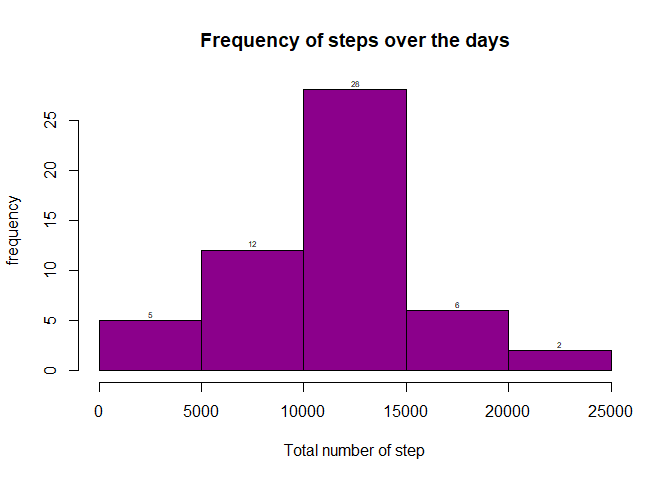
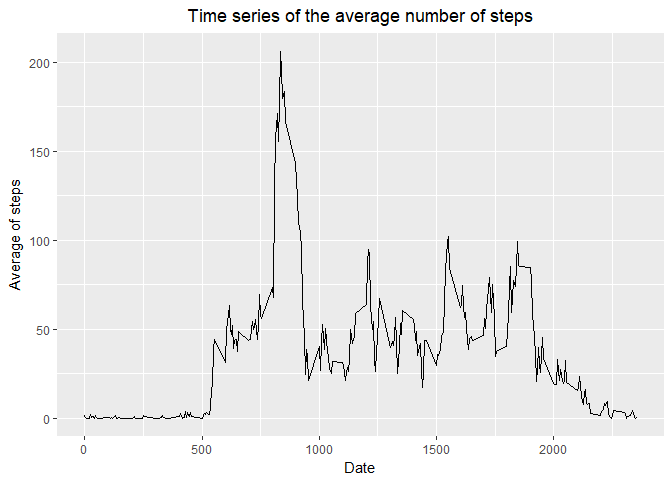
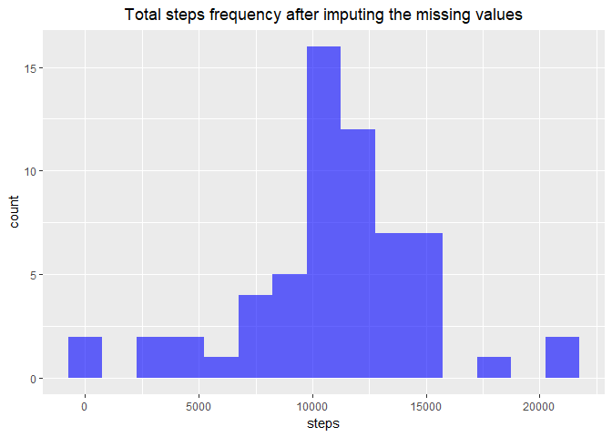
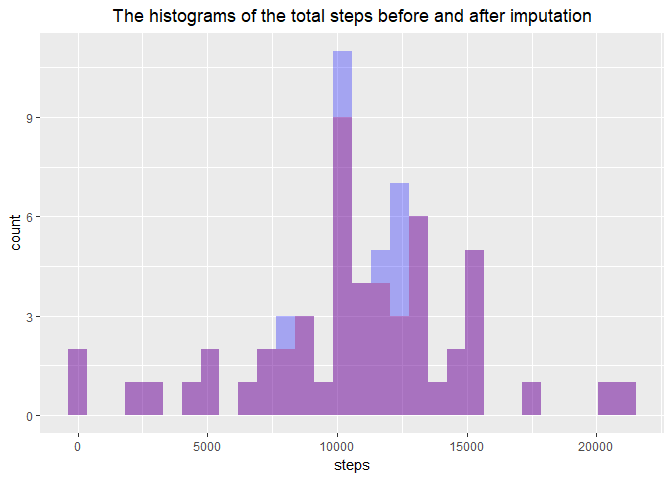
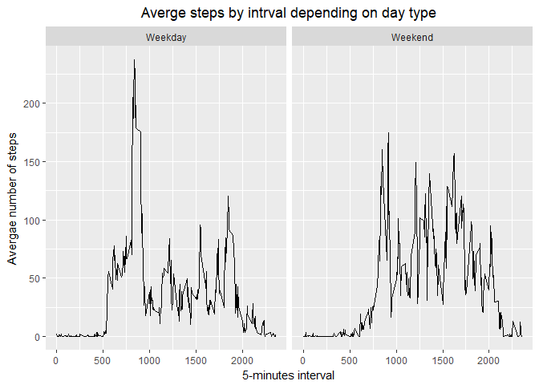

# Reproducible Research: Peer Assessment 1


### Reading and Preprocessing The Data
___
using ggplot for drawing charts, dplyr for manipulating the data frames  
load the data by download.file then unzipping and reading it

```r
library(ggplot2)
```

```
## Warning: package 'ggplot2' was built under R version 3.4.1
```

```r
library(dplyr)
```

```
## Warning: package 'dplyr' was built under R version 3.4.1
```

```
## 
## Attaching package: 'dplyr'
```

```
## The following objects are masked from 'package:stats':
## 
##     filter, lag
```

```
## The following objects are masked from 'package:base':
## 
##     intersect, setdiff, setequal, union
```

```r
if (!exists("activityData")){
  if(!file.exists("getdata-projectfiles-UCI HAR Dataset.zip")) {
          temp <- tempfile()
          download.file("http://d396qusza40orc.cloudfront.net/repdata%2Fdata%2Factivity.zip",temp)
          unzip(temp)
          unlink(temp)
  }
  
  activityData <- read.csv("activity.csv")
  activityData$date=as.Date(as.character(activityData$date))
}
head(activityData,3)
```

```
##   steps       date interval
## 1    NA 2012-10-01        0
## 2    NA 2012-10-01        5
## 3    NA 2012-10-01       10
```

### what is the total number of steps taken each day?
___
using aggregate function I summed the steps grouped by the date, then generated the histogram using basic hist function in R


```r
stepsSum=aggregate(steps~date,activityData,sum)
h<-hist(stepsSum$steps,col="darkmagenta",xlab = "Total number of step"
     ,ylab = "frequency",main="Frequency of steps over the days")
text(h$mids,h$counts,labels = h$counts,adj=c(0.5, -0.5),cex = 0.53)
```

<!-- -->


### Mean and median number of steps taken each day
___
Calculating the median and mean before imputing the missing values

```r
print(paste("mean:",mean(stepsSum$steps)))
```

```
## [1] "mean: 10766.1886792453"
```

```r
print(paste("median:",median(stepsSum$steps)))
```

```
## [1] "median: 10765"
```

### Time series plot of the average number of steps taken
___
The average is grouped by the 5-mintes interval as specified in the assignment description 


```r
stepsavg=aggregate(steps~interval,activityData,mean)
#theme ..to center the title 
ggplot(aes(x=interval,y=steps),data = stepsavg)+geom_line()+xlab("Date")+ylab("Average of steps")+ggtitle("Time series of the average number of steps")+  theme(plot.title = element_text(hjust = 0.5))
```

<!-- -->
### The 5-minute interval that, on average, contains the maximum number of steps
___

```r
maxinterval=stepsavg[stepsavg$steps==max(stepsavg$steps),"interval"]
paste("5 minutes-inteval gives max steps: ",as.character(maxinterval))
```

```
## [1] "5 minutes-inteval gives max steps:  835"
```

### Imputing missing values
___
Imputing the missing values by getting the mean of steps of the same weekday over the weeks and the same 5 minutes-interval intervl that has the missing value by:  
* adding weekday column to the data
* calculating average steps grouped by the weekday and the interval
* geeting the data with missing steps values and merging it to the average data by the interval and weekday

```r
activityData$weekday=weekdays(activityData$date)
clean=activityData[!(is.na(activityData$steps)),]
missing=activityData[is.na(activityData$steps),]
avgdata=group_by(clean,weekday,interval)%>%summarise(steps=mean(steps))
merged<-merge(select(missing,-steps),avgdata,by=c("interval","weekday"),all.x = TRUE)
alldata=rbind(clean,merged)
```

### what is the steps like after imputing the missing values ?
___
firt calculating the sum of steps after imputation the adding the histograms 

```r
stepsSum2=group_by(alldata,date)%>%summarise(steps=sum(steps))
ggplot(stepsSum2,aes(steps))+geom_histogram(data = stepsSum2, fill = "blue", alpha =0.6,binwidth = 1500 )+ggtitle("Total steps frequency after imputing the missing values")+theme(plot.title = element_text(hjust = 0.5))
```

<!-- -->

```r
ggplot(stepsSum2,aes(steps))+geom_histogram(data = stepsSum, fill = "red",alpha=0.3) +geom_histogram(data = stepsSum2, fill = "blue",alpha=0.3)+ggtitle("The histograms of the total steps before and after imputation")+theme(plot.title = element_text(hjust = 0.5))
```

```
## `stat_bin()` using `bins = 30`. Pick better value with `binwidth`.
## `stat_bin()` using `bins = 30`. Pick better value with `binwidth`.
```

<!-- -->

### what is the difference betwwen weekdays and weekends?
___

```r
alldata$dayFlag=ifelse(alldata$we %in% c("Saturday", "Sunday"), "Weekend", "Weekday")
#grouping by day type and interval
stepsavg2=group_by(alldata,dayFlag,interval)%>%summarise(avgsteps=mean(steps))
ggplot(data = stepsavg2,aes(interval,avgsteps))+geom_line()+facet_grid(.~dayFlag)+xlab("5-minutes interval")+ylab("Avergae number of steps")+ggtitle("Averge steps by intrval depending on day type")+theme(plot.title = element_text(hjust = 0.5))
```

<!-- -->
